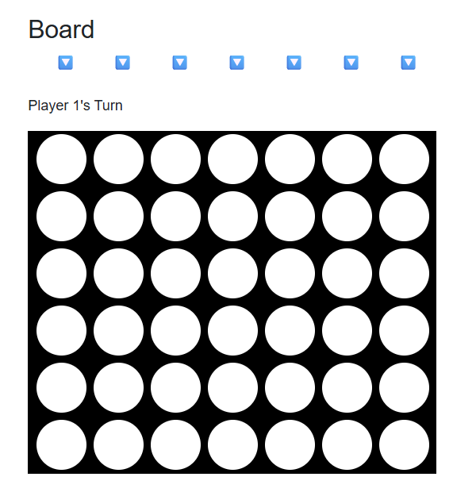
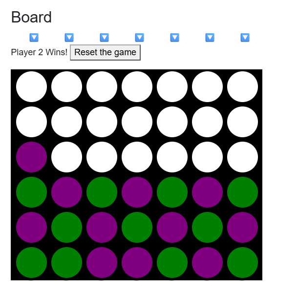

# Connect Four

This project is based on the last module (module 8) of the learning path
[Build web apps with Blazor](https://learn.microsoft.com/en-us/training/paths/build-web-apps-with-blazor/) with the name:
[Build a Connect Four game with Blazor](https://learn.microsoft.com/en-us/training/modules/dotnet-connect-four/)
The [Author](https://www.linkedin.com/in/musab-albirair/) took the liberty to
make small deviations from the instructions provided on Microsoft Learn platform
for educational purposes. Feel free to use it in any way you see fit and have fun.

## Screenshots

